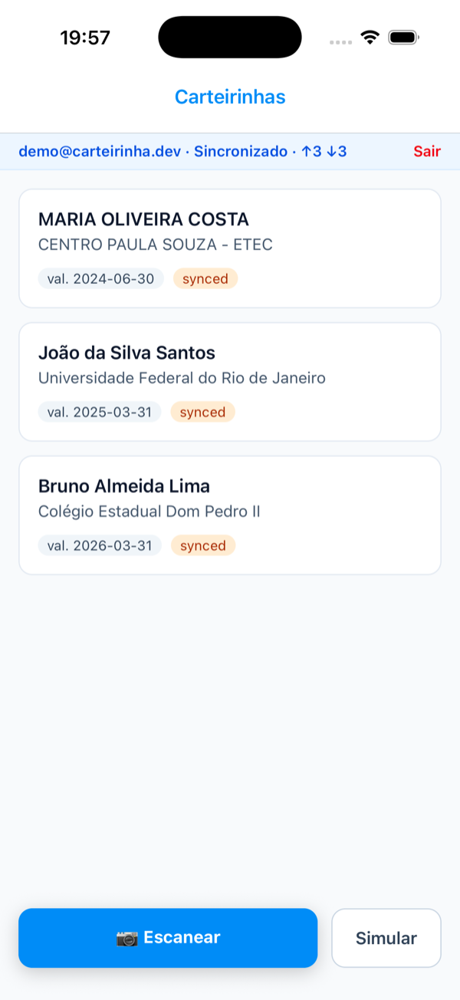
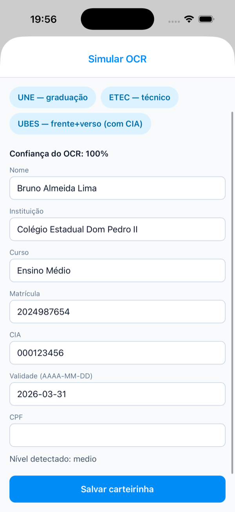
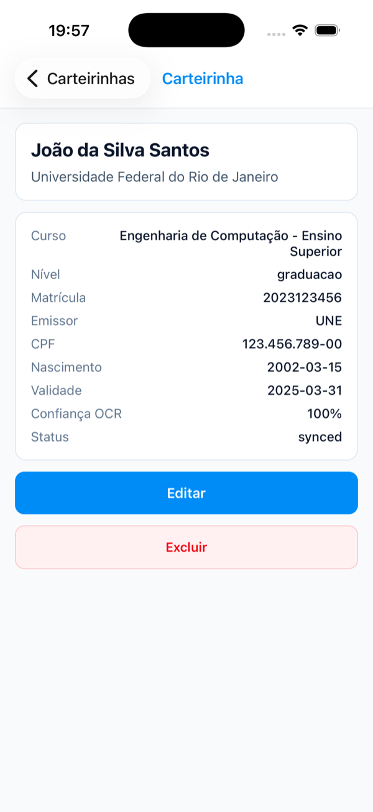
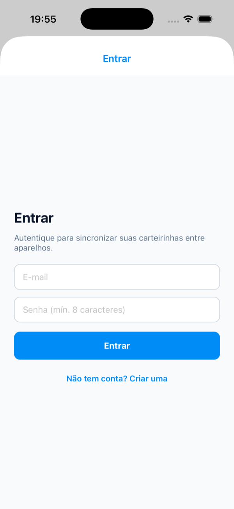

# Carteirinha OCR

App **offline-first** que lê carteirinhas de estudante pela câmera com **OCR no próprio aparelho**
(ML Kit), guarda tudo localmente e **sincroniza** com um backend quando há internet. Projeto
open-source de estudos em **React Native (Expo)** + **Node.js/TypeScript**.

<p align="center">
  
  
  
  
</p>

> 📄 A especificação completa (decisões de arquitetura, modelo de dados, protocolo de sync) está em
> [`specs.md`](./specs.md).

## O que o app faz

- **Escaneia frente e verso** da carteirinha e extrai nome, instituição, curso, matrícula, CIA,
  validade, nascimento e CPF com um parser testado (`@ocr/core`).
- **Revisão antes de salvar**: o usuário confere e corrige os campos; a confiança do OCR aparece
  na tela.
- **Funciona sem internet**: SQLite local é a fonte da verdade; cada mudança entra numa outbox.
- **Sincroniza** com a API (push/pull, Last-Write-Wins por `updatedAt`), com conta por e-mail e
  senha (JWT) e dados isolados por usuário.
- **Simular OCR**: amostras sintéticas para testar o fluxo sem câmera (útil no simulador).

## Privacidade

- O OCR roda no aparelho; **a foto nunca sai do celular** e é apagada do cache logo após a leitura.
- **O CPF não sincroniza**: nem o campo, nem dentro do texto bruto do OCR, que sai do aparelho
  com o CPF trocado por `[CPF removido]`. A API aplica a mesma limpeza ao gravar.
- **Sair da conta apaga os dados do aparelho**, para a próxima conta não herdar as carteirinhas.
- Testes e amostras usam apenas dados sintéticos.

## Stack

- **Monorepo:** pnpm workspaces + Turborepo · TypeScript estrito
- **Mobile:** Expo SDK 56 · Expo Router · expo-camera · ML Kit · expo-sqlite + Drizzle
- **Backend:** Fastify 5 · PostgreSQL · Drizzle · Zod · OpenAPI (Swagger em `/docs`) · JWT · rate-limit
- **Compartilhado:** `@ocr/core` (modelo de dados, schemas Zod, parser de OCR, limpeza de CPF)

```
apps/
  mobile/        # app Expo (câmera, OCR, SQLite, sync)
  api/           # Fastify + Postgres (auth, /cards, /sync)
packages/
  core/          # @ocr/core — domínio compartilhado (schemas + parser + privacidade)
  tsconfig/      # base de TypeScript
  eslint-config/ # regras de lint
```

## Rodando

Pré-requisitos: **Node 24+**, **pnpm 11+** e **Docker** (para o Postgres).

```bash
pnpm install
pnpm check            # typecheck + lint + testes em todos os pacotes
```

### API

```bash
cp .env.example apps/api/.env
# preencha JWT_SECRET em apps/api/.env (ex.: openssl rand -base64 32)
docker compose up -d                   # Postgres local na porta 55432
pnpm --filter @ocr/api db:migrate      # aplica as migrations
pnpm --filter @ocr/api dev             # http://localhost:3333 (Swagger em /docs)
```

### App

O ML Kit é um módulo nativo, então o app roda em **development build** (não no Expo Go):

```bash
cp .env.example apps/mobile/.env       # EXPO_PUBLIC_API_URL = IP da máquina na rede local
pnpm --filter @ocr/mobile ios          # ou: pnpm --filter @ocr/mobile android
```

- No celular, `EXPO_PUBLIC_API_URL` precisa ser o IP da máquina na rede (`ipconfig getifaddr en0`),
  não `localhost`. Sem a variável, o app funciona 100% offline, sem sync.
- No simulador do iOS em Mac com Apple Silicon, o ML Kit não tem build para simulador arm64:
  use um aparelho físico para a câmera, ou o botão **Simular** para testar o resto do fluxo.

## Status

M0 a M5 concluídos: fundação, API, app base, OCR no aparelho, motor de sync e autenticação.
Próximo passo (M6): polimento de UI e CI. Detalhes no [roadmap](./specs.md#13-roadmap).

## Licença

[MIT](./LICENSE)
